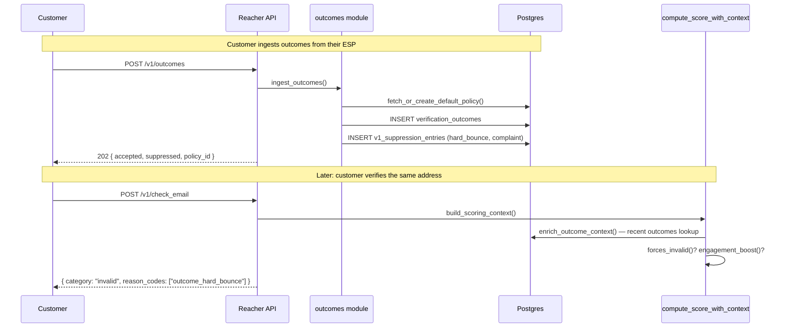

# Closing the Loop: How Real Bounce Data Makes Email Verification Smarter

*Published 2026-05-10 · Engineering · Reacher backend*

Email verification has always been an exercise in educated guessing. We probe a mail server with `RCPT TO`, watch how it answers, and infer whether a given address will accept mail later. That works most of the time. It also fails in predictable, frustrating ways: greylisting hides truth behind a five-minute timer, accept-all servers say `250 OK` to anything, anti-abuse systems serve us deliberately misleading responses. The honest answer for a meaningful slice of any list is **"unknown."**

The only way out of "unknown" is to actually send and see what happens.

We just shipped the missing half of the loop: customers can now POST campaign outcomes back to us — delivered, hard bounce, soft bounce, complaint, open, click, unsubscribe — and the platform uses that real-world ground truth to make every future verification smarter. This post walks through what changed, why we built it the way we did, and what comes next.

---

## The contextual scoring foundation

A few weeks back we shipped two coupled features in [PR #43](https://github.com/Oppulence-Engineering/paperless-check-if-email-exists/pull/43): **delayed recheck** for greylisted unknowns, and **contextual scoring** that pulled tenant verification history, local-part patterns (`first.last`, `firstlast`, etc.), provider reputation, and domain signals (MX/SPF/DKIM/DMARC, age, website) into the scorer.

That work changed Unknown from a binary verdict into a tier:

```json
"score": {
  "score": 65,
  "category": "risky",
  "confidence": 72,
  "confidence_level": "medium",
  "partial_confidence": {
    "confidence": 72,
    "classification": "timeout",
    "factors": ["mx_records_present", "tenant_history_safe", "domain_age_old"]
  }
}
```

The scorer could now say "this looks risky but the SMTP probe just timed out — wait the greylist window and try again." It was a real upgrade. But all of those signals still came from us probing servers — there was no signal from the customer's actual experience after they hit send.

## Why ground truth matters

A scorer reasoning about whether a mailbox exists is doing a fundamentally probabilistic thing. A customer reporting `hard_bounce` from their ESP is doing something else entirely: they're telling us what happened. That's not a signal. That's truth.

Once we have truth, the question stops being "should we suppress?" and becomes "why didn't we already know?" A tenant that has sent ten thousand campaigns has more information about their own audience than any number of SMTP probes can ever give us. The platform's job is to listen to it.

## Architecture

Three pieces, all already-shipped patterns reused wholesale:



**A new table.** `verification_outcomes` stores every event with a `(tenant_id, canonical_email, outcome_type, occurred_at, source)` unique constraint for idempotency. Three indexes — lookup by email, recency scan, campaign filter. Mirrors the same shape as `verification_change_events` from earlier work.

**A policy engine cloned from `v1_score_policies`.** Customers get full CRUD over `/v1/outcome-policies`. A sensible default is created lazily on first ingest, so zero configuration is the happy path:

```rust
// backend/src/outcomes.rs:121-141
pub fn default_outcome_policy_rules() -> OutcomePolicyRules {
    OutcomePolicyRules {
        hard_bounce: RuleAction::Suppress { score_override: Some("invalid".into()) },
        complaint:   RuleAction::SuppressAndUnsubscribe { score_override: Some("invalid".into()) },
        soft_bounce: RuleAction::SuppressAfter { threshold_count: 3, threshold_window_days: 30 },
        unsubscribe: RuleAction::Suppress { score_override: None },
        delivered:   RuleAction::ScoreBoost { boost: 5 },
        open:        RuleAction::ScoreBoost { boost: 3 },
        click:       RuleAction::ScoreBoost { boost: 8 },
        outcome_ttl_days: 90,
    }
}
```

**An extension to the scorer.** The contextual `ScoringContext` struct gains an `OutcomeContext` field, populated by `enrich_outcome_context` inside the existing `build_scoring_context` flow:

```rust
// backend/src/scoring/mod.rs (compute_score_with_context)
if context.outcomes.forces_invalid() {
    let reason_code = if context.outcomes.has_hard_bounce {
        "outcome_hard_bounce"
    } else {
        "outcome_complaint"
    };
    score.score = 5;
    score.category = EmailCategory::Invalid;
    score.safe_to_send = false;
    append_unique_codes(&mut score.reason_codes, vec![reason_code.into()]);
    return ScoreComputation { score, insights };  // 95 confidence, hard stop
}
```

The override sits **before** the existing `is_hard_invalid` early return — outcome ground truth wins over even syntactic invalidity. If your ESP told us last week that this address bounces, we don't care what the syntax detector or SMTP probe says today.

## The customer-configuration story

This was the part we deliberated on hardest. A feature you have to configure to use is a feature most customers won't use. Three touchpoints, that's it:

**1. Provision an API key with the new scope** — reuses the existing `PATCH /v1/me/api-keys/{id}` flow, just adds `outcomes.write` (or `outcomes.read`) to the scope list.

**2. (Optional) Tune the policy** — full CRUD over `/v1/outcome-policies`. Skip this and you get the default above on first ingest.

**3. Send outcomes** — pick whichever shape fits the customer's stack:

```
POST /v1/outcomes
{
  "outcomes": [
    {"email":"a@x.com","type":"hard_bounce","occurred_at":"2026-05-10T12:00:00Z","source":"sendgrid","campaign_id":"camp_42"},
    {"email":"b@y.com","type":"open","occurred_at":"2026-05-10T12:01:00Z","source":"sendgrid"}
  ]
}
→ 202 { "accepted": 2, "rejected": 0, "suppressed": 1, "policy_id": 17, "errors": [] }
```

For one-time backfills from ESP exports there's `POST /v1/outcomes/upload` (multipart CSV with `email,outcome_type,occurred_at,source,campaign_id` columns). To inspect, `GET /v1/outcomes?email=a@x.com&since=...`.

That's the entire customer surface area. We measured what we did and didn't include very carefully.

## What changes for the user

Concrete before/after for the same email and the same call:

```
# Before this PR
POST /v1/check_email { "to_email": "rotted@startup.com" }
→ { "category": "risky", "score": 65, "reason_codes": ["catch_all_high_risk"] }

# After this PR — same address, but customer sent a campaign last week and the bounce came back
POST /v1/check_email { "to_email": "rotted@startup.com" }
→ { "category": "invalid", "score": 5, "confidence": 95,
    "reason_codes": ["outcome_hard_bounce", "catch_all_high_risk"] }
```

The verification API didn't change shape. The customer didn't add new code. They just sent us their bounce data once, and now every verification — including verifications they ran *before* sending the campaign — uses that knowledge going forward.

For engagement signals the dynamic is gentler. Five `delivered` events in the last 90 days adds +5 to the score. A `click` adds +8 because it's the strongest "real human at the other end" signal we have. Capped at +15 total so engagement can't drag a 30 across the line into 50 — it's confirmation, not absolution.

## What we deliberately didn't ship

Three things stayed off the table for this PR despite being tempting:

**ESP-specific webhook receivers.** The obvious next step is letting customers point SendGrid/Postmark/Mailgun directly at Reacher with their existing webhook configs. We have the HMAC verification scaffolding ready in `backend/src/tenant/webhook.rs`. We chose not to ship it yet because each adapter is a separate event-shape mapping, signature scheme, and per-provider quirks list, and we don't want to commit to that surface area until the data path is proven. Customers can write the adapter themselves in a few hours.

**A frontend dashboard.** That's [backlog #19](https://github.com/Oppulence-Engineering/paperless-check-if-email-exists/blob/master/docs/advanced/customer-feature-backlog.md). It only becomes meaningful with this data substrate underneath it, which is now there. Building it first would have been visualization for visualization's sake.

**Cross-tenant aggregate signals.** A hard bounce reported by Tenant A on `bob@acme.com` is suggestive evidence for Tenant B querying the same address. We're not doing that yet — privacy and competitive-data implications need a real review, not a rushed implementation.

## What's next

[Backlog #19 — Deliverability trends dashboard](https://github.com/Oppulence-Engineering/paperless-check-if-email-exists/blob/master/docs/advanced/customer-feature-backlog.md) is the obvious follow-up. Now that outcome data exists per tenant, we can start showing customers what their list quality looks like over time, where bounce rates spike, which acquisition sources contribute the worst data. The data substrate makes the dashboard meaningful instead of decorative.

Beyond that, [RFC 0001](https://github.com/Oppulence-Engineering/paperless-check-if-email-exists/blob/master/docs/rfcs/0001-native-provider-webhooks-and-outcome-adapters.md) covers the ESP-specific webhook receiver path that's already drafted. The data model we landed in this PR is exactly the normalization target that RFC anticipated.

---

## Implementation notes

**Test surface:** 217 lib tests, 26 new e2e tests in `backend/tests/e2e_outcomes.rs` covering ingest (8), policy CRUD (5), suppression integration (4), scoring integration (5), listing/pagination (3), schema (1). 8 new entries in the canonical API harness so every route is exercised exactly once.

**Migration:** [`20260510000001_campaign_outcomes`](https://github.com/Oppulence-Engineering/paperless-check-if-email-exists/blob/master/backend/migrations/20260510000001_campaign_outcomes.up.sql) — `verification_outcomes` and `v1_outcome_policies` tables with three indexes apiece, symmetric down.

**Where the code lives:**
- Core module: [`backend/src/outcomes.rs`](https://github.com/Oppulence-Engineering/paperless-check-if-email-exists/blob/master/backend/src/outcomes.rs)
- HTTP endpoints: [`backend/src/http/v1/outcomes.rs`](https://github.com/Oppulence-Engineering/paperless-check-if-email-exists/blob/master/backend/src/http/v1/outcomes.rs), [`outcome_policies.rs`](https://github.com/Oppulence-Engineering/paperless-check-if-email-exists/blob/master/backend/src/http/v1/outcome_policies.rs)
- Scorer integration: [`backend/src/scoring/mod.rs`](https://github.com/Oppulence-Engineering/paperless-check-if-email-exists/blob/master/backend/src/scoring/mod.rs) (search for `forces_invalid`, `engagement_boost`)
- Pull request: [#44](https://github.com/Oppulence-Engineering/paperless-check-if-email-exists/pull/44)

If you've already got a Reacher API key with `outcomes.write`, you can start sending data today. The defaults are tuned to be useful immediately — and you can always tighten them later via the policy endpoints when you've seen what your real bounce/complaint patterns look like.
